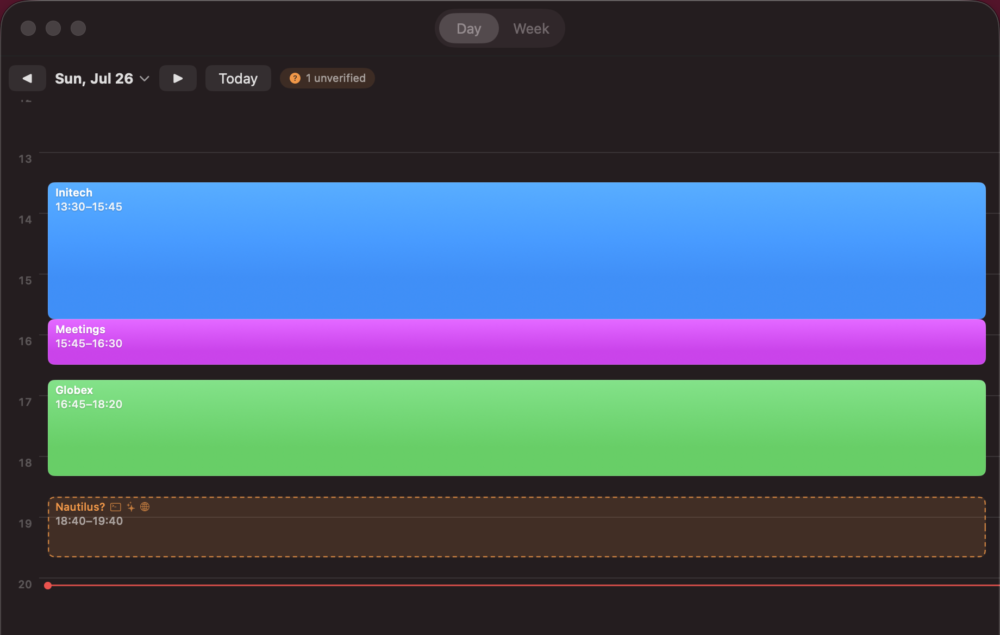
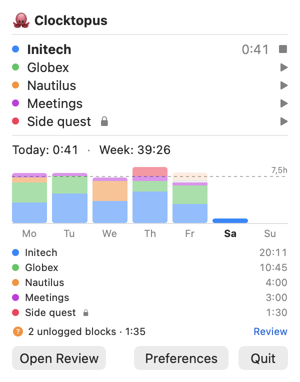
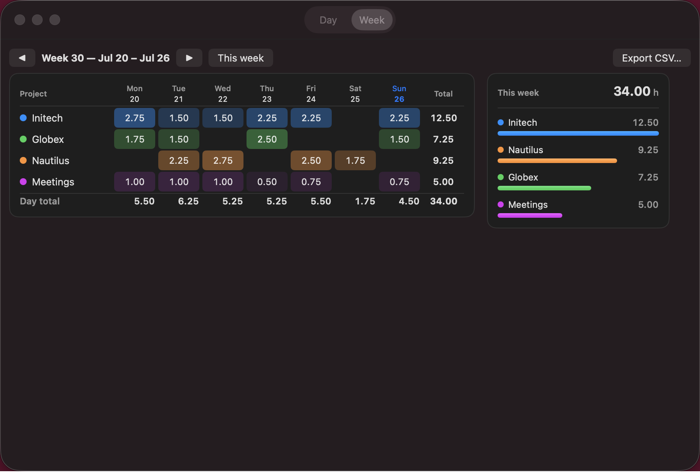

# Clocktopus 🐙

*Eight arms, all billable.*

A native macOS menubar time tracker that **notices** what you're working on
and asks — instead of watching you or trusting you to remember.

You clock in and out of projects from the menubar. When you forget (you will),
Clocktopus detects sustained activity from boring, deterministic signals —
which directory your shells are in, which tmux pane is active, what's in the
frontmost window title — and drops a dashed "is this Initech?" ghost block onto
your timeline. One click confirms it, backfilled to when you actually started.
One click dismisses it. Nothing is ever logged without your say-so.

At the end of the week, export a CSV for your billing system and go do
literally anything else.

<p align="center">
  
</p>

## No cloud. Anywhere. At all.

Every "automatic" time tracker wants a subscription, an account, and a
websocket to somebody else's dashboard. Many of them take screenshots of your
screen and run them through "AI productivity insights" that your manager reads.

Clocktopus is the opposite, on purpose:

- **The app makes zero network requests.** Not for sync, not for updates, not
  for telemetry, not for "anonymous usage statistics". Grep the source.
- **Your data is one SQLite file** in
  `~/Library/Application Support/Clocktopus/`. Query it, back it up, `rm` it.
- **Config is two TOML files** in `~/.config/clocktopus/`. Version-control
  them if you like.
- **No screenshots, no keylogging, no URL history.** Detection reads working
  directories, window titles, and (opt-in, per-browser) the frontmost tab's
  domain. Raw observations are summarized into human-readable evidence you can
  inspect on every suggestion.
- The only thing that ever leaves your machine is the CSV **you** export, to a
  file **you** pick in a save panel.

Your hours are between you, your invoice, and the octopus.

## How it notices

No ML, no vision models, no vibes — a scorer over signals you configure
yourself in TOML:

| Signal | What it reads |
|---|---|
| Terminal | cwd of your shells (foreground and background) |
| tmux | per-pane cwds, active pane weighted |
| AI coding tools | cwd of running `claude` / `codex` / `gemini` processes |
| Frontmost app | app name (`apps = ["Slack"]`) + window title keywords |
| Browser tab (opt-in) | the active tab's URL — Safari, Chrome, Brave, Edge, Arc. Rules match anywhere in the URL (deep links like `xledger.net/Customer/12345` work), but only the domain is ever stored |
| Browser profile | which Chrome/Edge/Brave profile the frontmost window belongs to — one profile per client? That's a signal |
| Idle | keyboard/mouse idle time, so lunch doesn't bill anyone |

Directory rules match longest-prefix-wins, so `~/src/initech-api` beats your
`~/src/` catch-all. Background signals (parked tmux panes, long-running AI
sessions) only *reinforce* a project that also has foreground evidence — a
forgotten pane can't clock you in from three days ago. A project has to hold
your focus for a couple of minutes (configurable) before a suggestion even
appears.

And it stays a *suggestion* — a dashed ghost card on the timeline showing its
evidence and which signals fired. Confirm it, resize it, reassign it, or
dismiss it.

<p align="center">
  
</p>

## Review & export

The Review window has a Day timeline (drag block edges to adjust, 5-minute
snapping) and a Week grid — ISO weeks, Monday start, with per-project totals
rounded to your billing increment. Late-night sessions stay on one work-day:
the day boundary defaults to 04:00, not midnight, because you were *finishing
something*.

Projects marked `private = true` appear in the Week report as Personal time and
count toward Total tracked. They never count as billable time and are always
excluded from CSV export. What happens on `Side quest` stays on `Side quest`.

<p align="center">
  
</p>

The CSV export emits [xledger](https://xledger.com)'s PM10 "Time
Transactions" import format — the 24-column semicolon-separated layout its
timesheet import ingests directly (employee, project and activity codes,
`yyyymmdd` dates, decimal hours per day). It's still just CSV, so point it
at whatever your accounting department worships.

## Install

Build from source (sorry — notarized releases need an Apple Developer ID, and
this octopus is young):

```sh
brew install xcodegen
git clone <this repo> && cd clocktopus
cd Core && swift test                  # 90+ tests on the core logic
cd ../App && xcodegen generate
xcodebuild -project Clocktopus.xcodeproj -scheme Clocktopus -configuration Release -derivedDataPath build/dd build
open build/dd/Build/Products/Release/Clocktopus.app
```

Requires macOS 13+. The build is ad-hoc signed, so if Gatekeeper complains,
right-click → Open the first time.

## Configure

Personal config, `~/.config/clocktopus/config.toml`:

```toml
employee = "TK"
team_config_path = "~/.config/clocktopus/team.toml"
```

Project list, `~/.config/clocktopus/team.toml` — share it with your team via
git, or keep it to yourself:

```toml
rounding_increment_hours = 0.25

[[project]]
name = "Initech"
xledger_project = "T200001"
xledger_activity = "DEV"
dirs = ["~/src/initech*"]              # terminal / tmux / AI-tool cwds
keywords = ["initech"]                 # frontmost window title
urls = ["github.com/initech"]          # active browser tab (opt-in), matched anywhere in the URL
browser_profiles = ["Initech"]         # Chrome/Edge/Brave profile of the frontmost window

[[project]]
name = "Meetings"
xledger_project = "T200000"
xledger_activity = "MEET"
apps = ["zoom.us", "Slack"]            # frontmost app, by name or bundle id

[[project]]
name = "Side quest"
xledger_project = "1"
xledger_activity = "PRIV"
private = true                         # tracked locally, never exported
```

Idle threshold, detection delay, nudge frequency, day-boundary hour and more
are editable live in Preferences.

## Permissions

Everything is optional except the first one, and everything degrades
gracefully:

- **Notifications** — the "you're working on something unlogged" nudges.
- **Accessibility** (optional) — window-title keyword matching. Terminal cwds,
  tmux, AI-tool and idle detection all work without it.
- **Automation** (optional, off by default) — browser-tab matching. macOS
  prompts per browser; only the domain is stored.

## Architecture

`Core/` is a pure SwiftPM package (models, scorer, store, exporter — GRDB +
TOMLKit, fully unit-tested). `App/` is a thin SwiftUI `MenuBarExtra` shell
generated by XcodeGen. If you want to change how detection scores things,
it's all in `Core/Sources/ClocktopusCore/` with tests to keep you honest.

## License

[MIT](LICENSE). Free as in free to stop paying $12/user/month for a clock.
